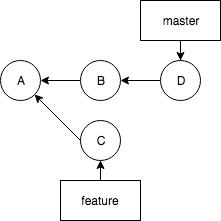

This is a starter for the codelabs dealing with merging branches.

In this starter, there are two branches:
* master
* feature



Both branches contain a different version of the file `file.txt`. As the files differs on different lines, 
the versions are non conflicting.

# How to use in the codelabs

```
git clone https://github.com/switchfully/git-starter-01 starter01
cd starter01
git checkout feature
git checkout master
```

# Initial situation of file.txt
## file.txt at commit A (where feature was created)

*file.txt*:
```
line 1
line 2
line 3
line 4
line 5
line 6
```

## file.txt at the master branch
```
line 1
line 2 <== modified in commit B
line 3
line 4
line 5
line 6 <== modified in commit D
```

## file.txt at the feature branch
```
line 1
line 2
line 3
line 4 <== modified in commit C
line 5
line 6
```
